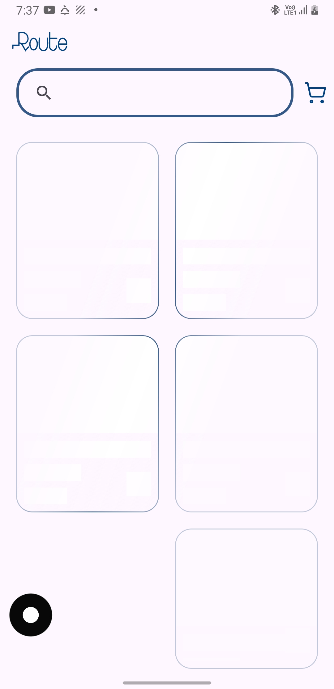
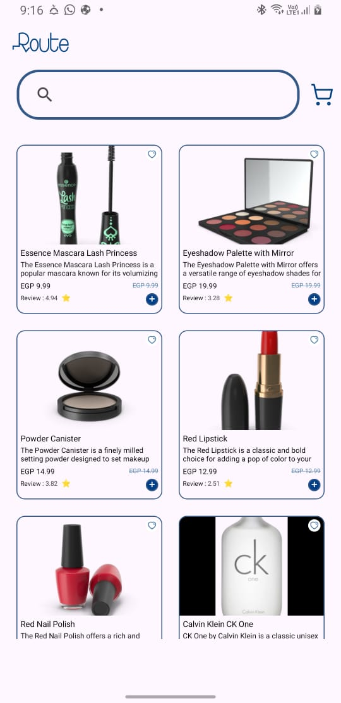
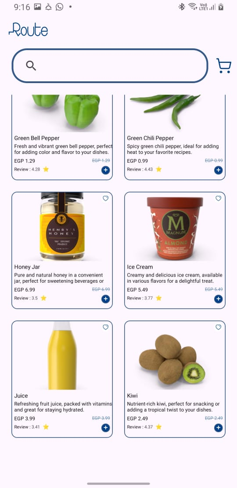
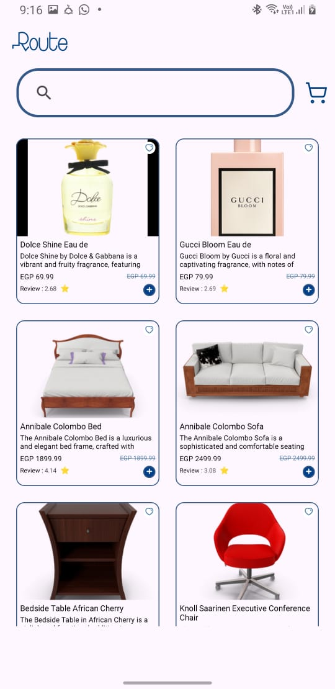

* **Technologies:**
     * Kotlin.
     * Clean Architecture.
     * Multi-Modules.
     * MVVM.
     * Repository Pattern.
     * Hilt.
  [Video from Run](https://drive.google.com/drive/folders/11KCxOYXjLtjSsYjoWtBG5x-NyW4EQdFy?usp=drive_link)

<table>
  <tr>
    <td></td>
    <td></td>
  </tr>
</table>
<table>
  <tr>
    <td></td>
    <td></td>
  </tr>
</table>
